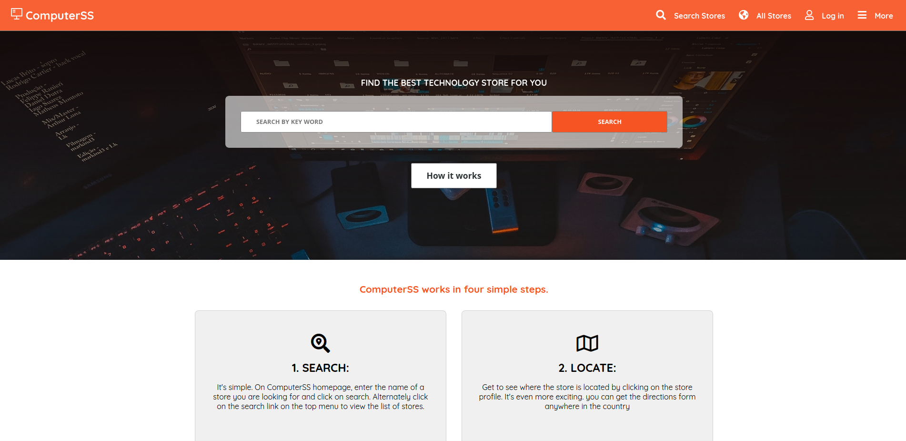

# HTML CSS Capstone Project

> This project is an assignment for the HTML/CSS capstone project base on a reference page to show the learning got into the module, I got more practice on this project and all those challenges have done before help me to progress.

Sass was implemented to use new features also I use flexbox grid system and position.

## Built With

- HTML
- CSS
- Sass
- Fontawesome
- VS Code

## Live Demo

[Live Demo Link](https://kenderb.github.io/HTML-CSS-capstone/)

## Getting Started

To get a local copy up and running follow these simple example steps.

### - You need to clone the repository on your device.

### - Unzip the repository or just clone it using git or github.

### - Grab the index.html file and open it on your favorite browser

##  - Try the page with the Demo Link above.

## Authors

👤 **Kender Bolivar**

- GitHub: [@kenderb](https://github.com/kenderb)
- Twitter: [@twitterhandle](https://twitter.com/KBTarts )
- LinkedIn: [LinkedIn](https://www.linkedin.com/in/kender-bolivar-1736086b/ )

## 🤝 Contributing

Contributions, issues, and feature requests are welcome!

Feel free to check the [issues page](https://github.com/kenderb/HTML-CSSCapstoneProject/issues).

## Show your support

Give a ⭐️ if you like this project!

## Acknowledgments
- PatashuleKE Original design [@PatashuleKE](https://www.behance.net/gallery/25563385/PatashuleKE
- We3schools.
- Stack Overflow.
- Sass Documentation.
